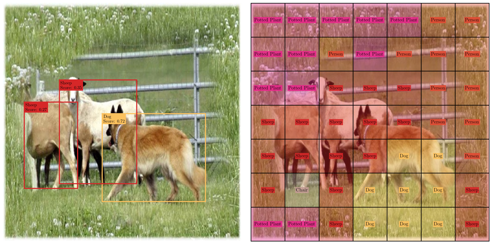

# A PyTorch Implementation of YOLOv1
This project uses the PyTorch framework to implement the architecture and training regime of YOLOv1 — the first widely recognized single-stage model for object detection.

## Project Overview


The first version of the _You Only Look Once (YOLOv1)_ model was introduced by [Redmon et al. (2016)](#references) as a real-time object detection system that was both faster and more easily optimized than previous detectors, such as _Regional Convolutional Neural Networks (R-CNNs)_. Its improvements stem from a novel single-stage design that predicts the bounding boxes and class labels directly from an image in a single forward pass. Specifically, YOLOv1 splits the input image into a `S×S` grid, where each cell predicts `B` bounding boxes and a probability distribution over `C` classes. The bounding box predictions include coordinates `(x_center, y_center, width, height)` and a confidence score that reflects both object presence and localization accuracy, measured by the _Intersection over Union (IoU)_ with the ground truth. Additionally, note that each cell only produces one class prediction (from the probability distribution) that is shared across all of its `B` bounding boxes. This is an inherent limitation of YOLOv1 that tends to cause it to predict poorly on images with small, nearby objects.

From [Redmon et al. (2016)](#references), the YOLOv1 model is trained on the combined _trainval_ sets from Pascal VOC 2007 and 2012 and was evaluated on the _test_ set from Pascal VOC 2007. During training, YOLOv1 assigns each ground truth object to a single grid cell (based on the object's center coordinates) and to one of the cell’s predicted bounding boxes (based on the highest IoU). The model is then optimized with a loss function that aims to balance object confidence, localization, and classification. During inference, confidence scores are used to reduce the inital `S*S*B` predictions by filtering out low-quality bounding boxes. Further reductions are then applied with class-wise _Non-Maximum Suppression (NMS)_ to remove multiple detections of the same object. 

This project implements the YOLOv1 model using the PyTorch framework. Although it remains largely faithful to the original paper by [Redmon et al. (2016)](#references), particularly in terms of the overall training and inference methods, there are also several important differences:
- Inspired by a prior implementation from [Ramesh et al. (2021)](#references), the backbone is replaced with the feature extractor of a **ResNet-50**, primarily for ease of access to pretrained weights from `torchvision.models.ResNet50_Weights.DEFAULT`.
- **Batch normalization layers** (`torch.nn.BatchNorm2d`) were added to the end of each convolutional block in the detector head.
- Due to GPU memory limitations, training with a batch size of `64` wasn't possible. Instead, a batch size of `32` was used along with **gradient accumulation**, updating the model every `2` batches to effectively mimic a batch size of `64`.
- The changes above—especially the addition of batch normalization—made the original learning rate schedule proposed by [Redmon et al. (2016)](#references) unstable, with the high post-warmup rate of `1E-2` causing exploding gradients. As a result, the schedule was modified: training starts at a learning rate of `2.5E-3` without warmup, and decays by a factor of `0.2` at epochs `75`, `105`, and `135`. The final milestone was included for optional training up to epoch `150`, instead of stopping at `135` as in the original paper.

Lastly, note that the original architecture from [Redmon et al. (2016)](#references) can still be replicated by setting the backbone to a `src.models.DarkNet()` instance and passing `include_bn=False` when initializing the `src.models.YOLOv1()` model.


## Recommended Installation Instructions
### 1) Create a New Python Environment
This environment should use **Python >= 3.10**.
### 2) Clone the `yolov1-pytorch` Repository
```
git clone git@github.com:Jechen00/yolov1-pytorch.git
```
### 3) Install Required Packages
Navigate to the `yolov1-pytorch` directory. 

To install all required packages for the **YOLOv1 model** and the **webcam application**, run:
```
pip install -r requirements.txt
```
If you only plan on using the YOLOv1 model (e.g. for training or inference), you can instead run:
```
pip install -r yolov1_requirements.txt
```
Alternatively, you may install the packages manually:
```
# Required for the YOLOv1 model
pip install matplotlib==3.10.3
pip install numpy==2.2.6
pip install pillow==11.2.1
pip install pyyaml==6.0.2
pip install torch==2.7.0
pip install torchmetrics==1.7.2
pip install torchvision==0.22.0

# Additionally required for the webcam application
pip install panel==1.4.5
```

## Training Instructions
The steps explained in this section are for training the YOLOv1 model through the provided Python script `run_training.py`.
However, an alternative option is available through a [Jupyter notebook](notebooks/yolov1_training.ipynb).

### 1) Modify Configurations
Edit the `config.yaml` file to configure _most_ settings, including:
- [Model architecture](https://github.com/Jechen00/yolov1-pytorch/blob/main/src/models.py#L223)
- [Dataloader (Pascal VOC)](https://github.com/Jechen00/yolov1-pytorch/blob/main/src/data_setup.py#L86)
- [Optimizer (SGD)](https://pytorch.org/docs/stable/generated/torch.optim.SGD.html)
- [Learning rate scheduler](https://github.com/Jechen00/yolov1-pytorch/blob/main/src/engine.py#L383)
- [Training and evaluation settings](https://github.com/Jechen00/yolov1-pytorch/blob/main/src/engine.py#L443)
- [Checkpointing settings](https://github.com/Jechen00/yolov1-pytorch/blob/main/src/engine.py#L480)

The default YOLOv1 model in this project uses a pretrained **ResNet-50** backbone. If you’d like to use a different backbone (e.g., DarkNet), you’ll need to modify `run_training.py` accordingly.

### 2) Run Training Script
To start training, run:
```
python run_training.py -cf config.yaml
```
## Webcam Application Instructions
### 1) Modify Saved Model
By default, the webcam application uses the **YOLOv1 + ResNet-50** model saved in `saved_models/yolov1_resnet50_model.pth` to perform bounding box and class label predictions. To use a different saved model, you'll need to modify the `create_app()` function in `webcam_app/app.py`. This may include:
-  Setting a different file path to your saved model.
-  Adjusting the configuration of the `src.models.YOLOv1()` instance (e.g. backbone, batch normalization laters).
### 2) Launch the Application
From within the `webcam_app` directory, run:
```
panel serve app.py --port=66
```
This will launch the application locally at `http://localhost:66/app`. Be sure to allow access to your webcam when prompted.

## References
Redmon, Joseph, et al. “You Only Look Once: Unified, Real-Time Object Detection.” _2016 IEEE Conference on Computer Vision and Pattern Recognition (CVPR)_, June 2016, pp. 779–788, https://doi.org/10.1109/cvpr.2016.91. 

Ramesh, Chinmay Polya, et al. "You Only Look Once (YOLO v1) with Pytorch." _HackMD_, 18 June 2021, https://hackmd.io/@Ul0fopwcQUm8m8Qy5V012w/HJ5nq3dcO. 

